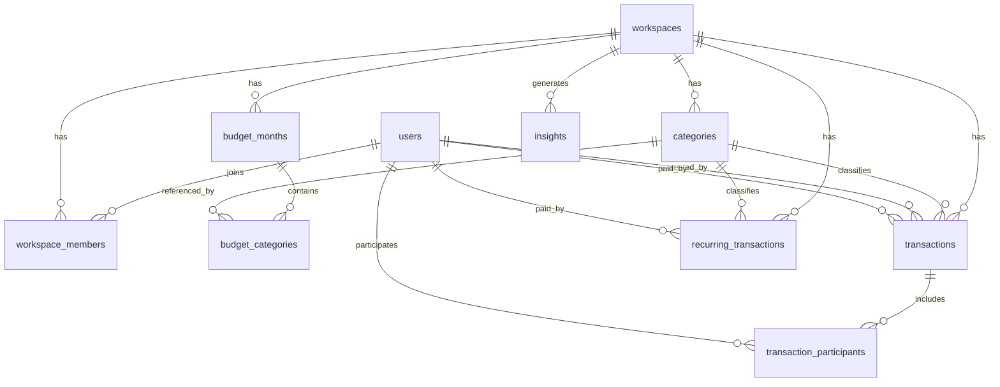

# BudgetFlow DB Schema Draft

## KR Summary

- 이 문서는 BudgetFlow MVP를 위한 초기 ERD 및 DB 스키마 초안이다.
- 핵심 기준은 `사용자`가 아니라 `workspace`이며, 모든 공유 데이터는 workspace에 속한다.
- 거래는 `누가 만들었는지(created_by)`와 `누가 결제했는지(paid_by)`를 분리해서 저장한다.
- 거래 공개 범위는 `shared`와 `personal`로 나누어, 같은 앱 안에서 함께 쓰는 돈과 개인 지출을 모두 다룰 수 있게 한다.
- 예산은 먼저 `월 전체 예산`을 정하고, 그 안에서 필요한 카테고리에 예산을 배정하는 구조다.
- 카테고리 예산 합계는 전체 예산보다 클 수 없고, 남는 금액은 `미배정 예산`으로 해석한다.
- MVP에서는 커플/가족 중심 구조로 설계하지만, 나중에 룸메이트나 소규모 팀 확장도 가능하도록 너무 가정적인 이름은 피한다.
- 정산 기능은 MVP 필수는 아니지만, `transaction_participants` 구조를 두어 이후 분담 계산으로 확장할 수 있게 한다.

## 1. Schema Goals

This schema is designed to:
- support shared household budgeting for couples and families
- allow personal and shared transactions inside one workspace
- keep roles simple for MVP
- support future expansion into settlements, attachments, and richer insights
- stay friendly to PostgreSQL and ORM-based backend development

## 2. Core Design Decisions

### Workspace-first model
- Shared data belongs to a workspace, not directly to a user.
- A user may join multiple workspaces in the future.

### Personal and shared transactions coexist
- Every transaction belongs to a workspace.
- `visibility` controls whether a transaction is shared or personal.
- Personal transactions still live in the same workspace so dashboards can selectively include them later.

### Creator and payer are different
- `created_by` means who recorded the transaction.
- `paid_by` means who actually paid.
- This distinction matters for shared households.

### Total budget comes first
- Each month can have one total budget amount for the workspace.
- Category budgets are allocations inside that monthly total.
- The sum of category budgets should not exceed the monthly total budget.
- If the sum is lower, the difference is treated as unallocated budget.

### Settlement-ready without requiring settlement now
- Participant rows allow future split logic.
- MVP can ignore advanced calculations and still keep the data model future-proof.

## 3. Entity Relationship Overview

## 4. Tables

## 4.1 users

Stores the account owner identity.

| Column | Type | Notes |
| --- | --- | --- |
| id | uuid pk | primary key |
| email | varchar unique | login email |
| password_hash | varchar nullable | nullable for social login |
| name | varchar | display name |
| profile_image_url | text nullable | optional |
| locale | varchar | default `ko-KR` |
| timezone | varchar | default workspace or user timezone |
| created_at | timestamptz | |
| updated_at | timestamptz | |

## 4.2 workspaces

Represents a shared household space.

| Column | Type | Notes |
| --- | --- | --- |
| id | uuid pk | primary key |
| name | varchar | workspace name |
| slug | varchar unique nullable | public-friendly identifier |
| type | varchar | ex: `couple`, `family`, `roommate` |
| base_currency | char(3) | default `KRW` |
| timezone | varchar | reporting boundary |
| owner_user_id | uuid fk users.id | initial creator |
| created_at | timestamptz | |
| updated_at | timestamptz | |

## 4.3 workspace_members

Membership and simple permission model.

| Column | Type | Notes |
| --- | --- | --- |
| id | uuid pk | primary key |
| workspace_id | uuid fk workspaces.id | |
| user_id | uuid fk users.id | |
| role | varchar | `owner`, `member` |
| status | varchar | `invited`, `active`, `left` |
| nickname | varchar nullable | optional workspace-level nickname |
| joined_at | timestamptz nullable | |
| created_at | timestamptz | |
| updated_at | timestamptz | |

Recommended constraints:
- unique `(workspace_id, user_id)`

## 4.4 categories

Shared category definitions per workspace.

| Column | Type | Notes |
| --- | --- | --- |
| id | uuid pk | primary key |
| workspace_id | uuid fk workspaces.id | |
| name | varchar | ex: Groceries |
| type | varchar | `income` or `expense` |
| color | varchar nullable | UI token |
| icon | varchar nullable | UI token |
| sort_order | int | default ordering |
| is_default | boolean | seeded category |
| is_archived | boolean | soft hide |
| created_at | timestamptz | |
| updated_at | timestamptz | |

Recommended constraints:
- unique `(workspace_id, type, name)`

## 4.5 transactions

The main ledger table.

| Column | Type | Notes |
| --- | --- | --- |
| id | uuid pk | primary key |
| workspace_id | uuid fk workspaces.id | |
| category_id | uuid fk categories.id nullable | |
| type | varchar | `income` or `expense` |
| visibility | varchar | `shared` or `personal` |
| amount | numeric(14,2) | positive amount only |
| currency | char(3) | default workspace currency |
| transaction_date | date | business/reporting date |
| memo | text nullable | optional note |
| created_by_user_id | uuid fk users.id | who recorded it |
| paid_by_user_id | uuid fk users.id nullable | who paid |
| recurring_transaction_id | uuid fk recurring_transactions.id nullable | source recurrence |
| is_deleted | boolean | soft delete |
| created_at | timestamptz | |
| updated_at | timestamptz | |

Recommended rules:
- `amount > 0`
- category type should match transaction type
- `paid_by_user_id` should be a member of the workspace

## 4.6 transaction_participants

Optional participant rows for later split and settlement logic.

| Column | Type | Notes |
| --- | --- | --- |
| id | uuid pk | primary key |
| transaction_id | uuid fk transactions.id | |
| user_id | uuid fk users.id | participating member |
| share_type | varchar | `equal`, `fixed`, `percentage` |
| share_value | numeric(14,2) nullable | amount or percent |
| created_at | timestamptz | |

Recommended use:
- MVP can create rows only for shared expenses if needed
- If omitted in MVP logic, keep table reserved for future rollout

## 4.7 budget_months

Monthly budget container by workspace.

| Column | Type | Notes |
| --- | --- | --- |
| id | uuid pk | primary key |
| workspace_id | uuid fk workspaces.id | |
| year | int | |
| month | int | 1-12 |
| total_budget_amount | numeric(14,2) nullable | monthly total budget ceiling |
| created_by_user_id | uuid fk users.id | |
| created_at | timestamptz | |
| updated_at | timestamptz | |

Recommended constraints:
- unique `(workspace_id, year, month)`

Recommended interpretation:
- This is the top-level budget for the month.
- Users should be able to set this even if no category budgets exist yet.
- Dashboard should show:
  - total monthly budget
  - allocated category budget total
  - unallocated budget
  - actual spending

## 4.8 budget_categories

Category-level budget amounts inside a month.

| Column | Type | Notes |
| --- | --- | --- |
| id | uuid pk | primary key |
| budget_month_id | uuid fk budget_months.id | |
| category_id | uuid fk categories.id | |
| planned_amount | numeric(14,2) | |
| alert_threshold_pct | int nullable | ex: 80 |
| created_at | timestamptz | |
| updated_at | timestamptz | |

Recommended constraints:
- unique `(budget_month_id, category_id)`

Recommended business rule:
- Sum of `planned_amount` for one `budget_month_id` must be less than or equal to `budget_months.total_budget_amount`
- If `total_budget_amount` is null, category budgets may still exist, but MVP should encourage users to set the total first

Recommended interpretation:
- These rows are allocations of the monthly total budget, not a separate budgeting system
- Unallocated money is valid and should be visible in the UI

### Example

If March total budget is `2,000,000 KRW`:
- Groceries: `600,000`
- Transport: `200,000`
- Utilities: `400,000`

Then:
- allocated budget = `1,200,000`
- unallocated budget = `800,000`
- category allocations remain valid because they do not exceed the total monthly budget

## 4.9 recurring_transactions

Templates for recurring bills and income.

| Column | Type | Notes |
| --- | --- | --- |
| id | uuid pk | primary key |
| workspace_id | uuid fk workspaces.id | |
| category_id | uuid fk categories.id nullable | |
| type | varchar | `income` or `expense` |
| visibility | varchar | `shared` or `personal` |
| amount | numeric(14,2) | |
| currency | char(3) | |
| memo | text nullable | |
| paid_by_user_id | uuid fk users.id nullable | |
| repeat_unit | varchar | `monthly`, `weekly`, `yearly` |
| repeat_interval | int | default 1 |
| day_of_month | int nullable | for monthly recurrence |
| day_of_week | int nullable | for weekly recurrence |
| start_date | date | |
| end_date | date nullable | |
| is_active | boolean | |
| created_by_user_id | uuid fk users.id | |
| created_at | timestamptz | |
| updated_at | timestamptz | |

## 4.10 insights

Stores generated product insights for dashboard cards or notifications.

| Column | Type | Notes |
| --- | --- | --- |
| id | uuid pk | primary key |
| workspace_id | uuid fk workspaces.id | |
| type | varchar | ex: `budget_warning`, `recurring_upcoming` |
| title | varchar | short message |
| body | text | display copy |
| status | varchar | `active`, `dismissed` |
| reference_type | varchar nullable | related entity type |
| reference_id | uuid nullable | related entity id |
| generated_at | timestamptz | |
| expires_at | timestamptz nullable | |

## 5. Suggested Indexes

- `workspace_members (workspace_id, status)`
- `transactions (workspace_id, transaction_date desc)`
- `transactions (workspace_id, visibility, transaction_date desc)`
- `transactions (workspace_id, category_id, transaction_date desc)`
- `transactions (paid_by_user_id, transaction_date desc)`
- `budget_months (workspace_id, year, month)`
- `recurring_transactions (workspace_id, is_active)`
- `insights (workspace_id, status, generated_at desc)`

## 6. Suggested Enum Values

### workspace.type
- `couple`
- `family`
- `roommate`

### workspace_members.role
- `owner`
- `member`

### workspace_members.status
- `invited`
- `active`
- `left`

### categories.type
- `income`
- `expense`

### transactions.visibility
- `shared`
- `personal`

### transaction_participants.share_type
- `equal`
- `fixed`
- `percentage`

## 7. Example Query Use Cases

### Monthly shared spending
- Sum `transactions.amount`
- Filter by `workspace_id`
- Filter `type = 'expense'`
- Filter `visibility = 'shared'`
- Filter `transaction_date` in current month

### Per-member payer summary
- Group transactions by `paid_by_user_id`
- Show who paid the most this month

### Budget progress by category
- Join `budget_categories` with transactions by category and month
- Compare `planned_amount` and actual spend

### Monthly budget summary
- Read `budget_months.total_budget_amount`
- Sum all `budget_categories.planned_amount`
- Calculate `unallocated_budget = total_budget_amount - allocated_sum`
- Compare actual monthly spend against the total budget

## 8. What We Are Intentionally Not Modeling Yet

- reimbursement approvals
- receipt OCR pipeline
- bank sync connections
- company/team cost centers
- audit log detail tables
- advanced split settlement history

## 9. Recommended Next Step

After agreeing on this schema direction, the next artifact should be:
- API contract draft for auth, workspace, transactions, budgets, and reports

Alternative next step:
- convert this schema draft into actual PostgreSQL DDL or Prisma schema
